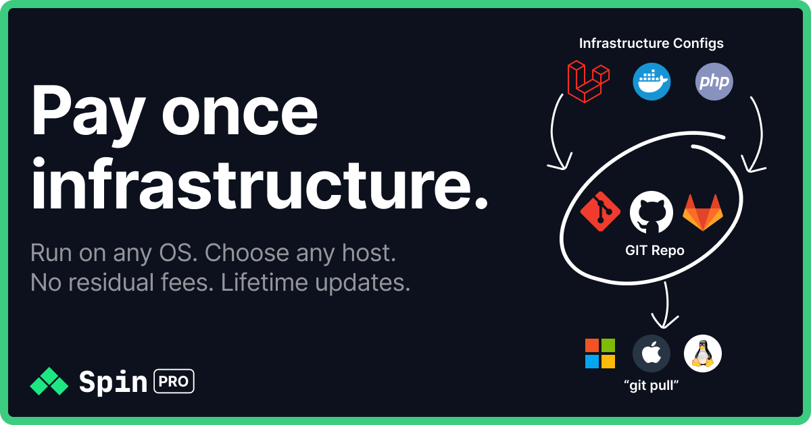

<p align="center">
		<a href="https://getspin.pro"></a>
</p>

# 🏆 Spin Pro - Laravel Stack Template
This is a fork of the official [Spin Pro Laravel template](https://github.com/serversideup/spin-template-laravel-pro). It includes Laravel, Redis, Reverb, Queues, and more. Spin Pro is a local development environment that makes it easy to create and manage your projects. Spin Pro is built on top of Docker Compose and Docker Swarm, making it easy to manage your application from development to production.

## 🔀 What is different from the official template

### Data in named volumes
The official template stores development data for MySQL, MariaDB, PostgreSQL, Redis and Meilisearch as bind mounts under `.infrastructure/volume_data/` inside the project folder.

This template stores that data in named Docker volumes instead, matching how production already works:

| Service     | Official template (dev)                                       | This template (dev)                   |
|-------------|---------------------------------------------------------------|---------------------------------------|
| MySQL       | `./.infrastructure/volume_data/mysql/database_data/`          | `mysql_data:/var/lib/mysql`           |
| MariaDB     | `./.infrastructure/volume_data/mariadb/database_data/`        | `mariadb_data:/var/lib/mysql`         |
| PostgreSQL  | `./.infrastructure/volume_data/postgres/database_data/`       | `postgres_data:/var/lib/postgresql`   |
| Valkey      | `./.infrastructure/volume_data/redis/data`                    | `redis_data:/data`                    |
| Meilisearch | `./.infrastructure/volume_data/meilisearch/meilisearch_data`  | `meilisearch_data:/meili_data`        |
| Typesense   | not available                                                 | `typesense_data:/data`                |
| MinIO       | not available                                                 | `minio_data:/data`                    |

SQLite is unchanged. The whole project folder is bind mounted into the `php` container during development, so the SQLite file stays at `.infrastructure/volume_data/sqlite/database.sqlite`.

Named volumes are created per project (Docker Compose prefixes them with the project name) and survive `spin down`. To wipe the data, run `spin down --volumes` or remove the volume with `docker volume rm`.

### One shared proxy, every project running at the same time
The official template starts a Traefik container per project on ports 80 and 443, so only one project can run at a time. This template uses a single shared Traefik instance for all projects:

- The installer copies `proxy/docker-compose.yml` and `proxy/traefik.yml` to `~/.spin-proxy/` (override with `SPIN_PROXY_DIR`) and starts it. It owns ports 80, 443 and 8080 (dashboard at http://localhost:8080) and restarts with Docker.
- Projects no longer run their own Traefik in development. Services that need a hostname (`php`, `node`, `mailpit`, `reverb`, `meilisearch`, `typesense`, `minio`) join the external `spin-proxy` network and carry `traefik.docker.network=spin-proxy`. Router and service names are prefixed with the project name so they never collide.
- PHP containers get `extra_hosts` entries mapping the project hostnames to `host-gateway`, so code inside a container can call its own public URL (Reverb broadcasting, self-requests) through the proxy.
- The database is the only service that still publishes a host port. Its port is derived from the project name (`DB_FORWARD_PORT` in `.env`, between 10000 and 59999) so two projects never fight over 3306 or 5432.

If the proxy is not running, `spin up` fails with `network spin-proxy declared as external, but could not be found`. Start it with:

```shell
docker compose -f ~/.spin-proxy/docker-compose.yml up -d
```

### Trusted certificates with mkcert
The certificate that ships with Spin only covers `*.dev.test`, so project hostnames like `my-app.test` show browser warnings. When [mkcert](https://github.com/FiloSottile/mkcert) is installed (`brew install mkcert && mkcert -install`), the installer generates:

- `~/.spin-proxy/certs/default.pem` for `*.test` and `localhost` (the proxy's default certificate)
- `~/.spin-proxy/certs/<project>.pem` for `<project>.test` and `*.<project>.test`, registered through `~/.spin-proxy/dynamic/<project>.yml`

Traefik watches the `dynamic/` directory, so new certificates are picked up without a restart. Without mkcert the proxy falls back to a self-signed certificate and the installer prints the command to run later.

### Project-specific names instead of `laravel`
The official template names everything `laravel` and expects you to rename things by hand afterwards. This template derives two names from the project directory (for example `my-app`):

- `my-app` (lowercase, hyphens kept) for hostnames and the Docker network
- `myapp` (hyphens removed) for the database name, user, password and bucket

and applies them during install:

| What                              | Official template                        | This template                                   |
|-----------------------------------|------------------------------------------|-------------------------------------------------|
| App URL / Traefik host            | `laravel.dev.test`                       | `my-app.test`                                   |
| Vite, Mailpit, Reverb, Meilisearch| `vite.dev.test`, `mailpit.dev.test`, ... | `vite.my-app.test`, `mailpit.my-app.test`, ...  |
| Typesense                         | not available                            | `typesense.my-app.test` (dashboard), `typesense-api.my-app.test` |
| MinIO                             | not available                            | `minio.my-app.test` (console), `s3.my-app.test` (S3 API) |
| Docker network (dev)              | `development`                            | `my-app`                                        |
| Database name / user / password   | `laravel` / `root` / `rootpassword`      | `myapp` / `myapp` / `myapp`                     |
| Database root password (dev)      | `rootpassword`                           | `root`                                          |
| Database host port                | `3306` / `5432`                          | derived, see `DB_FORWARD_PORT`                  |

Database and Valkey credentials in `docker-compose.dev.yml` read `DB_DATABASE`, `DB_USERNAME`, `DB_PASSWORD`, `DB_ROOT_PASSWORD`, `DB_FORWARD_PORT` and `REDIS_PASSWORD` from `.env`, with the values above as fallbacks, so the compose file and Laravel always agree.

Hostnames under `.test` resolve automatically when a local resolver is configured (for example dnsmasq with `/etc/resolver/test` on macOS). Otherwise the installer prints the `/etc/hosts` line to add.

### Testing database out of the box
The MySQL, MariaDB and PostgreSQL blocks mount an init script (`.infrastructure/conf/<engine>/create-testing-database.sh`) that creates `<database>_test` on first start and, for MySQL and MariaDB, grants the app user access to every `<database>*` database so `php artisan test --parallel` works. `phpunit.xml` is pointed at that database instead of SQLite in memory.

### Valkey instead of Redis
The `redis` service runs `valkey/valkey:9-alpine` with `valkey-server` and `valkey-cli`. The service keeps the name `redis` so `REDIS_HOST=redis` and the Horizon block work unchanged.

### Typesense and MinIO blocks
Two extra optional features in the installer:

- **Typesense** (`typesense/typesense:30.2`) with the Laravel Scout driver (`laravel/scout` + `typesense/typesense-php`), `SCOUT_DRIVER=typesense`, and the [typesense-dashboard](https://github.com/bfritscher/typesense-dashboard) UI at `https://typesense.<project>.test`. Point the dashboard at `https://typesense-api.<project>.test` with the `TYPESENSE_API_KEY` from `.env`.
- **MinIO** (`minio/minio`) with a one-shot `minio-setup` service that creates the bucket from `AWS_BUCKET` and allows anonymous downloads. `.env` gets `AWS_ACCESS_KEY_ID`, `AWS_SECRET_ACCESS_KEY`, `AWS_BUCKET`, `AWS_ENDPOINT=http://minio:9000`, `AWS_URL=https://s3.<project>.test/<bucket>` and `AWS_USE_PATH_STYLE_ENDPOINT=true`. Set `FILESYSTEM_DISK=s3` to use it. The console is at `https://minio.<project>.test`.

### Laravel Boost
The installer requires `laravel/boost` as a dev dependency. Run `spin exec php php artisan boost:install` afterwards to pick guidelines, skills and MCP setup interactively.

### Different defaults in the installer
Every prompt still appears. Only the pre-selected answers differ:

| Prompt                    | Official default | This template                                  |
|---------------------------|------------------|------------------------------------------------|
| Server variation          | fpm-nginx        | frankenphp                                     |
| Operating system          | debian           | alpine                                         |
| PHP extensions            | none             | `gd,intl`                                      |
| Laravel features          | none             | Task Scheduling, Horizon, Octane (if FrankenPHP)|
| Database                  | none             | MySQL, Valkey                                  |
| JavaScript package manager| yarn             | npm                                            |
| Server contact            | empty            | `davorminchorov@gmail.com` (or `SPIN_SERVER_CONTACT`) |

The installer also makes an initial git commit once the project is generated.

### Moving an existing project to the shared proxy
For a project generated from the official template:

1. Remove the `traefik` service from `docker-compose.dev.yml` and `docker-compose.yml` (keep it in `docker-compose.prod.yml`) and the `depends_on: traefik` on `php`.
2. Add `spin-proxy` (with `external: true`) to the top-level `networks`, attach it to every service with Traefik labels, and add the `traefik.docker.network=spin-proxy` label.
3. Prefix router and service names in the labels with the project name.
4. Generate a certificate: `mkcert -cert-file ~/.spin-proxy/certs/<project>.pem -key-file ~/.spin-proxy/certs/<project>-key.pem <project>.test "*.<project>.test"` and create `~/.spin-proxy/dynamic/<project>.yml` with a `tls.certificates` entry for it.

Everything else (GitHub Actions, production compose files) is identical to the official template, and this repository tracks it as the `upstream` git remote.

### 🚀 Quick Start
You can create a new Laravel project with Redis, Reverb, Queues, and more in less than a minute.

Once you have your computer prepared to run Spin, you can create a new project by running the following command:

```shell
spin new davorminchorov/spin-template-laravel-stack
```

To add it to an existing Laravel project instead:

```shell
spin init davorminchorov/spin-template-laravel-stack
```

To use a local checkout of this repository without pushing it anywhere:

```shell
spin new --local ~/Code/GitHub/spin-template-laravel-stack my-project
```

The official Spin Pro documentation applies to this template as well:

[Read the docs →](https://getspin.pro/docs)

## 📕 Resources
- **[Website](https://getspin.pro/)** overview of the product.
- **[Docs](https://getspin.pro/docs)** for a deep-dive on how to use the product.
- **[Discord](https://serversideup.net/discord)** for friendly support from the community and the team.
- **[Official template on GitHub](https://github.com/serversideup/spin-template-laravel-pro)** for the upstream source code.
- **[This template on GitHub](https://github.com/davorminchorov/spin-template-laravel-stack)** for the named-volumes fork.
- **[Get Professional Help](https://serversideup.net/professional-support)** - If you need video + screen-sharing support, we offer that too.

## ❤️ Contributing
We're a community that strives on helping each other. If you're interested in contributing to this project, here are some ways you can help:

- **Bug Report**: If you're experiencing an issue while using these images, please [create an issue](https://github.com/serversideup/spin-template-laravel-pro/issues/new/choose).
- **Feature Request**: Make this project better by [submitting a feature request](https://github.com/serversideup/spin-template-laravel-pro/discussions/6).
- **Documentation**: If something doesn't make sense, take a screenshot and [create an issue](https://github.com/serversideup/spin-template-laravel-pro/issues/new/choose)
- **Community Support**: Help others on [GitHub Discussions](https://github.com/serversideup/spin-template-laravel-pro/discussions) or [Discord](https://serversideup.net/discord).
- **Security Report**: Report critical security issues via [our responsible disclosure policy](https://www.notion.so/Responsible-Disclosure-Policy-421a6a3be1714d388ebbadba7eebbdc8).